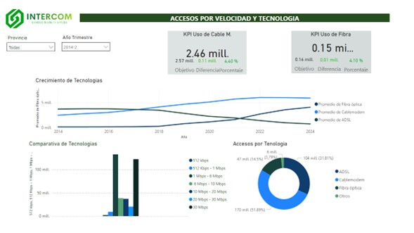

 
# Servicios de Telecomunicaciones en Argentina
### Introducción
EL siguiente proyecto tiene como objetivo determinar áreas de oportunidad dentro del pais de `Argentina` para brindar servicios de internet proporcionados por la empresa `Intercom`, para ello es necesario determinar los `lugares` y el tipo de `Servicio` a otorgar a partir de la información analizada.

  ### Objetivos
- Determinar las zonas de interes a partir del acceso al servicio de internet segun su `rango` y `Tecnologia` mas usada
- Determinar las oportunidad de negocio a partir del ainformacion analizada
- Establecer metricas que permitan determinar la evolución de los puntos de interés.

### Información
La informacion a continuacion analizada proviene del `ENACOM`, que es el ente nacional de comunicaciones de argentina el cual recopila y provee de forma abierta los datos recopilados a partir del 2014 con informacion desde accesos por telefonia fija, internet, servicios de TV por suscripcion, mercado postal, facturacion, etc.

Esta informacion nos permite obtener un amplio panorama de la evolucion de las telecomuicaciones dentro del pais en los ultimos años

### Analisis y transformaciones
Dentro de la información analizada se lograron encontrar como primer puntos algunas tablas con informacion duplicada, elementos nulos/vacios, datos incorrectos, entre otras cosas, este tipo de analisis se llevo a cabo por medio del uso de las herramientas integradas dentro del entorno de `Python` como son `seaborn` , `pandas`,`numpay`, etc. una vez transformada la informacion se realizo un analisis genenral de los datos contenidos en todas las tablas para conocer su distrubicion, datos de interes, entre otras cosas.

### Información de Interes
Dentro de los datos contenidos y por medio del uso de graficos, se logro observar que existen zonas (provincias) dentro del pais de argentina que actualmente no cuenta con la suficiente penetracion del servicio de internet, ademas, se observo la tendencia de rangos de velocidad de internet que suelen ser mas solicitados dentro de los servicios en las distintas regiones del pais, asi como el cambio en infraestructura que ha ido mejorando conn el paso de los años.

### Indicadores Claves de Rendimiento (KPI)
Dentro de los indicadores desarrollados se encuentra el indicador de `penetracion por cada 100 hogares`
  - Este indicador nos permite ver la evolución trimestral de los hogares que solicitan un acceso a internet

Debido a la información analizada, se ha determiando que las principales tecnologias a utilizar por el nuevo servicio de internet que se prentede proveer en el Pais de argentina son la `Fibra Optica y Cable Modem` y es por ello que se han generado dos indicadores, cada uno correspondiente a cada tecnologia

Indicador de `Crecimiento del uso de cable modem`
  - Este indicador nos permite visualizar el progreso del uso de tecnologia de cable moden respecto a otras tecnologias de forma trimestral

Indicador de `Crecimiento del uso de Fibra Optica`
  - Este indicador nos permite visualizar el progreso del uso de tecnologia de cable moden respecto a otras tecnologias de forma trimestral

### Dashboard
Para presentar toda la información relevante es necesario el uso de herramientas visuales que permitan comprender los hallagoz realizados

